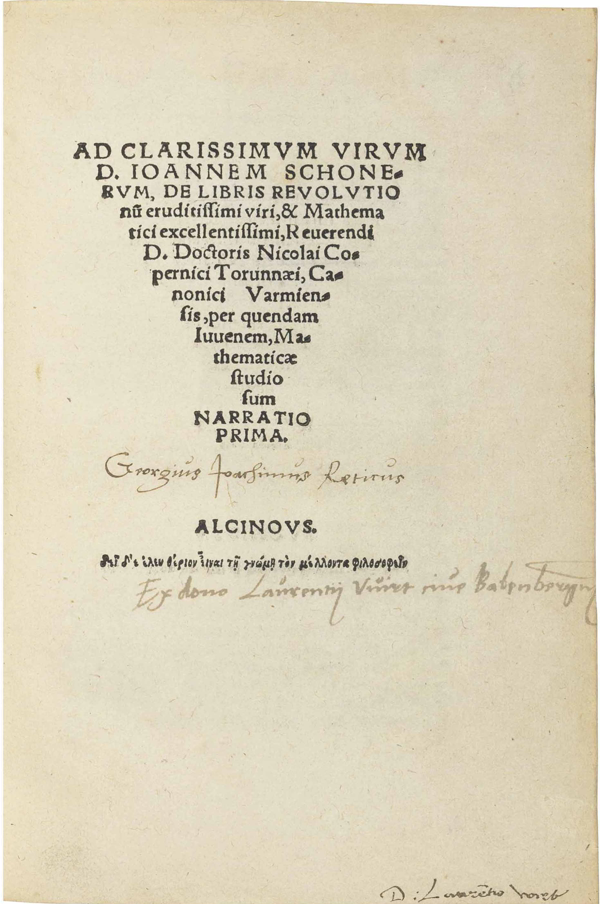
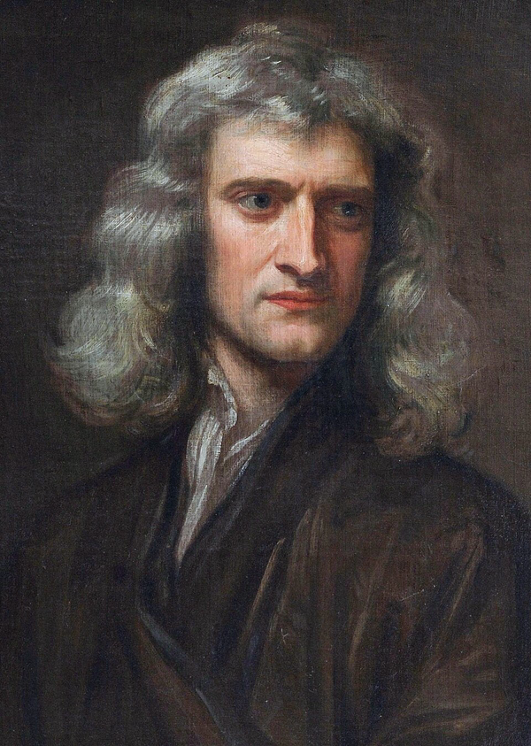
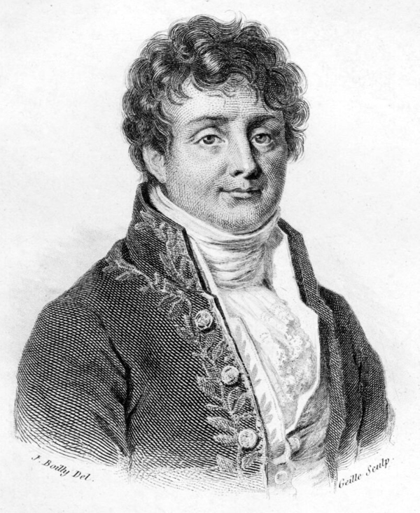
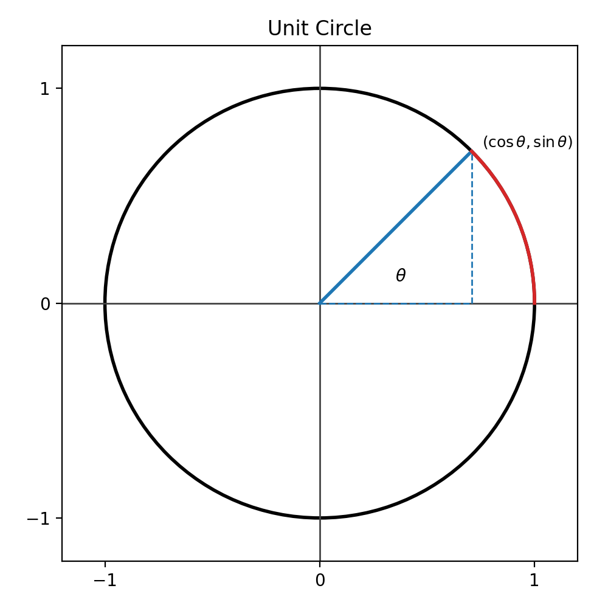
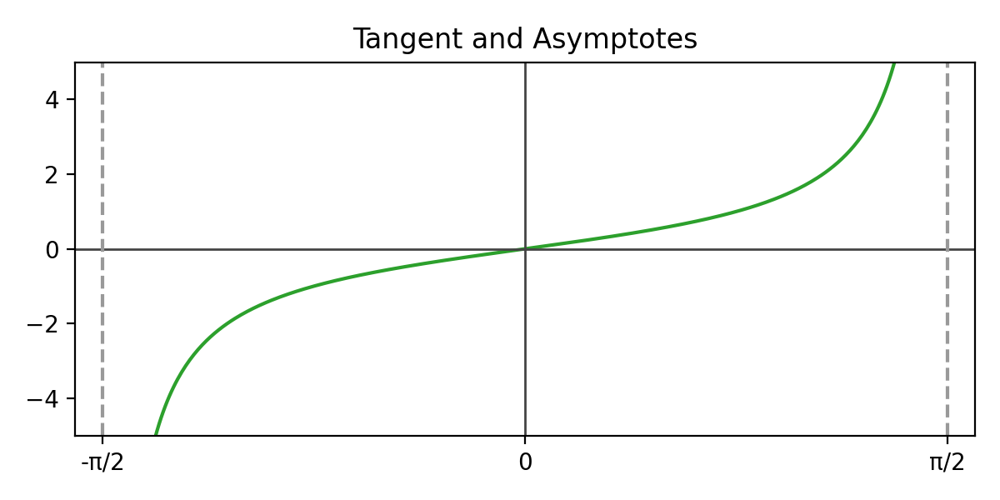
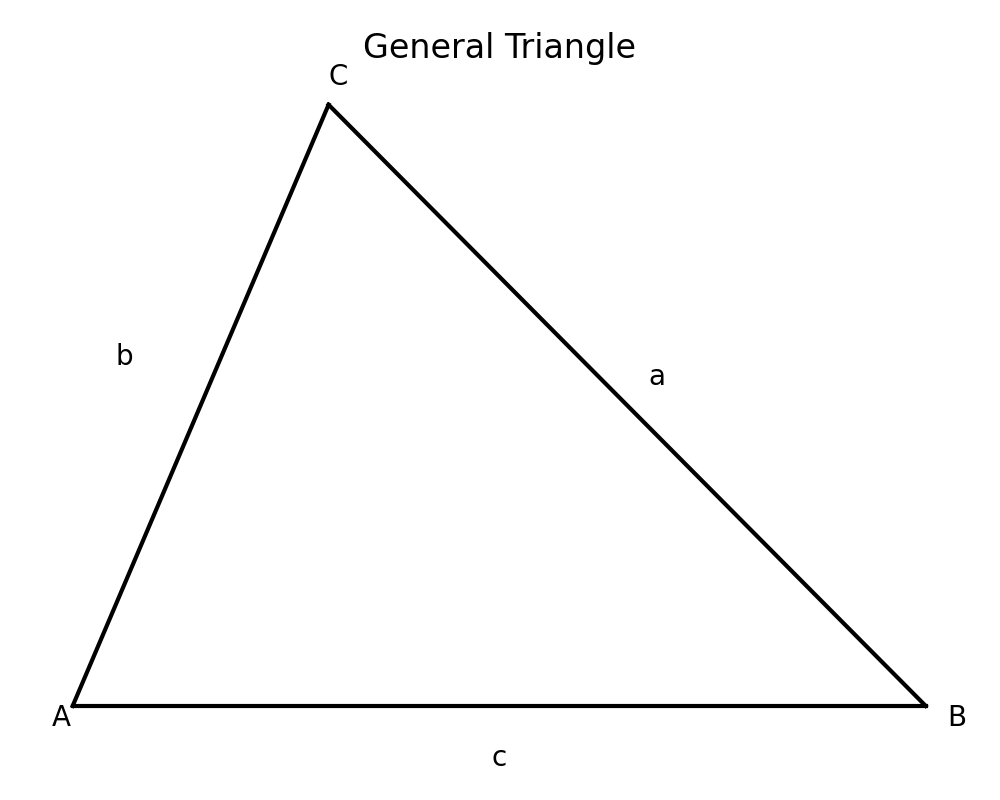
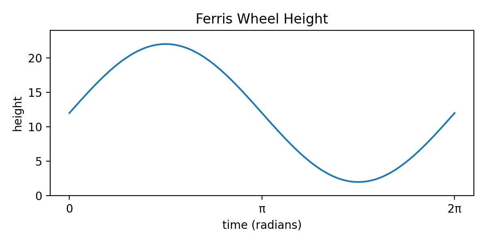

# 历史发展

三角函数的诞生并不是为了“漂亮的公式”，而是由真实而迫切的测量需求驱动的。古人要测天体的高度、确定航行方位、评估城墙高度或河流宽度，问题的核心都指向一个关系：**角度如何与长度相联系**。在几何图形里，角是“形”的语言；在测量与计算里，长度是“数”的语言。三角函数恰好是一座桥梁，让“角”的信息可以被转译成“可计算的数字”，从而为天文学、测地学、工程学奠定了共同的基础。

为了看清它的成长轨迹，我们可以把三角函数的历史分成三个里程碑：

- **里程碑一：古典时期（公元前2世纪—公元6世纪）**：从“弦表”到“半弦表”，三角关系开始表格化，并在天文学中得到系统应用。
- **里程碑二：中世纪到文艺复兴（公元9世纪—公元16世纪）**：阿拉伯世界继承并发展三角计算，欧洲逐步将三角学独立成学科。
- **里程碑三：近代与现代（公元17世纪—公元19世纪）**：函数观念确立，三角函数进入分析数学和物理学的核心舞台。

在每个里程碑中，我们选取三位代表人物，用故事化的方式讲述他们如何把“角与边的关系”一步步推向成熟。

**时间轴速览**（便于读者快速定位）：

- 公元前2世纪：希帕恰斯建立弦表雏形。
- 公元2世纪：托勒密系统化弦表与计算方法。
- 公元5—6世纪：阿耶波多提出正弦表，推动概念转型。
- 公元9—10世纪：巴塔尼改进三角表精度与应用。
- 公元15世纪：雷吉奥蒙塔努斯将三角学独立成学科。
- 公元16世纪：雷蒂库斯扩展三角函数表与实用体系。
- 公元17世纪：牛顿把三角函数纳入分析框架。
- 公元18世纪：欧拉确立现代符号与函数观念。
- 公元19世纪：傅里叶揭示三角函数的波动分解能力。

这条时间线反映了一个重要事实：**三角函数的进步从来不是孤立的，而是跨文明、跨学科的接力**。从希腊到印度，从阿拉伯到欧洲，每一次传播都带来新的改进与再解释。数学史告诉我们，思想的流动本身就是推动数学发展的动力。
> 说明：人物画像来自公开资料（Wikimedia Commons），具体来源见文末脚注。

---

## 里程碑一：古典时期——从“弦”到“正弦”

### 1. 希帕恰斯（Hipparchus）：把角度变成表格

希帕恰斯生活在公元前2世纪。他的时代，天文学并不是“浪漫的观星”，而是国家治理与航海安全的技术支柱。若要制定可靠历法，必须预测日月运行；若要跨海航行，必须根据天体位置判断方向。问题在于：天体的运动是“角度变化”，而人类需要的是“可计算的数值”。

在几何中，圆心角决定弧长，而弧长又与弦长相关。希帕恰斯提出一个关键思路：**用圆弧对应的弦长来描述角度**。他尝试建立“角度—弦长”的数值表，即弦表。这个思路极具突破性：它让角度不再只是几何图形中的抽象量，而是可以被具体数值标记、查表计算的对象。可以说，弦表是三角函数最早的雏形。

在当时，计算工具极其有限，希帕恰斯不得不依赖几何构造与重复计算。他的弦表虽然不如后世精细，但它代表了一种观念转变：**从图形推导到表格计算**。正是这种“表格化”的方法，让天文学进入了可重复、可校验的量化时代。

希帕恰斯的贡献不只是一个表格，而是方法论的突破。他把“角”与“数”绑在一起，从此角度可以进入算术与代数的世界。这个思想后来被托勒密系统化，被印度数学家转化为“正弦表”，最终形成现代三角函数的骨架。[^hipparchus]

### 2. 托勒密（Ptolemy）：把弦表系统化

托勒密生活在公元2世纪的亚历山大里亚。他的《天文学大成》（Almagest）是古典天文学的集大成之作。相比希帕恰斯，托勒密面对的是更复杂的天文模型和更高的计算精度需求。他需要大量角度对应的数值，而零散的几何技巧已经不够用了。

托勒密的核心贡献是**系统地给出了弦表，并建立了计算方法**。他采用当时通用的六十进制计数，使得天文计算更精确、更方便。他还提出著名的“托勒密定理”，即圆内接四边形的对边乘积之和等于对角线乘积。这个定理不仅有几何美感，更是弦表计算的关键工具：它允许把复杂角度拆成较小角度，从而一步步推算出所需弦长。

托勒密的弦表精度更高，结构更清晰，更重要的是，它被放入一部系统化的科学著作中，这使弦表从“个人技巧”变成了“可传承的科学工具”。这本书在后世传播极广，几乎成为欧洲与伊斯兰世界的天文学教科书。可以说，托勒密让三角计算从“天文学家的笔记”升级为“文明共享的技术”。[^ptolemy]

### 3. 阿耶波多（Aryabhata）：从弦表到正弦表

阿耶波多生活在公元5—6世纪的印度，是古代印度数学与天文学的重要代表。他继承了弦表传统，但做出了一个极有意义的“改写”：**把弦长的一半作为基本量**。在印度传统中，“弦”称为 jya，“半弦”称为 ardha‑jya。这实际上就是现代“正弦”的雏形。

为什么要用半弦？理由非常实际。半弦的取值范围更自然：它的最大值正好是半径，与直角三角形中的“高”或“对边”能够直接对应，这使得几何图形与数值计算之间的关联更紧密。阿耶波多在《阿耶波多书》中给出了正弦表，并提供了递推与近似计算方法，使得天文计算更加高效。

更重要的是，阿耶波多的工作推动了**语言与概念的演化**。后来，阿拉伯世界把 jya 音译为 jaib，又在拉丁文中演变为 sinus，最终成为现代“sin”。语言的转换背后，是概念的稳定化：正弦从一种“几何半弦”逐渐变成一个“函数概念”。阿耶波多的贡献使三角函数迈出了从几何到代数的关键一步。[^aryabhata]

---

## 里程碑二：中世纪—文艺复兴——三角学的独立

### 4. 巴塔尼（Al‑Battani）：改进表格与精度

巴塔尼生活在公元9—10世纪，是伊斯兰黄金时代的天文学家。阿拉伯世界在翻译希腊、印度文献的过程中吸收了大量天文学与数学成果。巴塔尼继承了弦表与正弦表传统，但他并不满足于简单传承，而是推动了精度与方法的改进。

巴塔尼编制了更精细的三角表，并发展了正弦、余弦、正切等关系的运算方法。他强调数值精度的重要性，并把三角计算与天体观测结合起来，使其成为一种可以服务宗教历法、航海和地理测量的实用工具。更重要的是，他让“正弦表”成为一个稳定的科学工具，而非仅在某些特定文本中出现的技巧。

巴塔尼的工作代表了伊斯兰世界对三角学的系统改造：在此阶段，三角计算不再只是“计算弦长”，而是形成了正弦、余弦、正切之间的结构性关系。这个结构后来经由拉丁译本传入欧洲，为文艺复兴时期的三角学独立奠定了基础。[^albategnius]

### 5. 雷吉奥蒙塔努斯（Regiomontanus）：三角学成为“学科”

雷吉奥蒙塔努斯生活在15世纪的欧洲文艺复兴时期。他的著作《论各种三角形》（De triangulis omnimodis）常被视为欧洲第一部系统三角学教材。在他之前，三角计算多附属于天文学或几何学；而在他手中，三角学第一次被“独立出来”，成为一门可教授、可研究的学科。

他强调一般三角形的研究，而不仅限于直角三角形。这一点十分重要：现实测量中，很多问题无法简化为直角三角形，而需要处理任意三角形。雷吉奥蒙塔努斯通过系统整理角度与边长的关系，让“解三角形”成为一种可操作的技能，服务于航海、地图绘制、建筑和军事工程。

他的贡献不仅是理论性的，更是教育性的。他提供了清晰的知识结构：定义、定理、表格、应用，层层递进。这种写作方式使三角学从“专家手册”转变为“学习体系”。从此以后，三角学进入学校与学术机构，成为科学训练的重要组成部分。[^regiomontanus]

### 6. 雷蒂库斯（Rheticus）：用表格与系统把三角学推广开

雷蒂库斯是16世纪的数学家与天文学家，他既是哥白尼学说的重要传播者，也是三角学表格的系统整理者。他编纂的《全三角书》（Opus Palatinum de Triangulis）包含了当时最详尽的三角函数表，覆盖了正弦、余弦、正切等函数的取值范围，精度显著提升。

在雷蒂库斯之前，三角表往往分散在天文学著作中，且范围有限。雷蒂库斯则将其系统化、扩展化，使得“查表计算”成为可推广的公共方法。他的表格不仅被天文学家使用，也被测量师、航海家、工程师广泛采用，直接推动了三角学在实际技术领域的普及。

可以说，雷蒂库斯让三角函数真正成为“工程语言”。从此之后，三角学不再局限于理论推演，而是进入了大规模应用阶段。这种“表格 + 方法”的体系，为后来函数观念的出现提供了数值基础。[^rheticus]

---

## 里程碑三：近代与现代——函数化与物理化

### 7. 牛顿（Isaac Newton）：把三角函数带入分析框架

17世纪的牛顿推动了微积分的诞生，而微积分的一个核心应用，就是研究函数的变化规律。三角函数在牛顿的工作中扮演了重要角色：他研究了正弦、余弦的幂级数展开，为后来函数逼近与数值计算提供了基础。

牛顿的时代，数学逐渐从几何形象转向解析表达。三角函数不再只是“解三角形的工具”，而是具有可微、可积的函数对象。牛顿的幂级数思想意味着：正弦、余弦可以被视为无限多项式的极限，这使得三角函数可以被纳入统一的分析体系，与代数和微积分结合。

更重要的是，牛顿把数学与物理联系起来。光学、力学中的振动问题都需要描述周期变化，而正弦、余弦正是最自然的描述方式。牛顿的工作让三角函数进入了“动态世界”，成为描述变化的语言。[^newton]

### 8. 欧拉（Leonhard Euler）：现代符号与函数观念的确立

欧拉是18世纪最具影响力的数学家之一，他把三角函数彻底纳入“函数”观念。他推广了现代常用的符号 sin、cos、tan，使三角函数的表达更简洁、更标准化。他还展示了三角函数与指数函数之间的深层联系，提出了著名的欧拉公式 $e^{ix}=\cos x + i\sin x$，虽然这是高等数学内容，但它凸显了三角函数在数学结构中的核心地位。

在欧拉的笔下，三角函数拥有了更强的“代数身份”：它们可以被看作函数、可以参与方程、可以与复数结合。这种函数化的转变意义深远，它让三角函数脱离了纯几何背景，进入了更广阔的数学世界。

欧拉还系统整理了三角恒等式与诱导公式，使得计算更高效。他的成果不仅推动了理论数学的发展，也直接服务于物理与工程，为后来的波动理论奠定了基础。[^euler]

### 9. 傅里叶（Joseph Fourier）：三角函数的“波动语言”

19世纪的傅里叶研究热传导问题，面对的难题是：温度在物体中传播时随时间变化，其形状复杂多样，如何用数学表达？傅里叶提出了革命性的思想：**任何复杂的周期变化，都可以分解为一系列正弦与余弦的叠加**。这就是傅里叶级数思想。

傅里叶的贡献不在于重新定义三角函数，而在于展示它们的“普适性”。正弦和余弦不仅能描述角度关系，还能描述任何周期性变化：声波、光波、电流、热流都可以用三角函数来表达。这一思想直接影响了现代通信、信号处理和工程分析。

从高中视角看，傅里叶告诉我们：三角函数的价值远远超出“解三角形”。它们是一种能够拆解复杂变化的语言，是连接数学与自然规律的桥梁。傅里叶让三角函数成为描述世界的“通用频率词典”。[^fourier]

---

## 小结：一条从测量走向函数的长路

三角函数的历史，是一条从“测量需求”走向“函数体系”的道路。希帕恰斯和托勒密把角度变成表格；阿耶波多把弦改写成正弦；巴塔尼、雷吉奥蒙塔努斯和雷蒂库斯推动三角学体系化；牛顿与欧拉让它进入分析数学；傅里叶让它成为描述自然世界的核心语言。理解这段历史，有助于我们把课本公式视为真实问题的回应，而非凭空出现的规则。

三角函数既来自现实，又反过来塑造现实。它在天文观测中诞生，在工程测量中成长，在函数分析中成熟，在物理世界中绽放。它的历史提醒我们：**数学的生命力源于问题，数学的力量在于连接。**

[^hipparchus]: https://commons.wikimedia.org/wiki/File:Hipparchus.jpg
[^ptolemy]: https://commons.wikimedia.org/wiki/File:Claudius_Ptolemy,_half-length_portrait,_facing_right_LCCN93515230.jpg
[^aryabhata]: https://commons.wikimedia.org/wiki/File:Aryabhata.jpeg
[^albategnius]: https://commons.wikimedia.org/wiki/File:Albategnius.jpeg
[^regiomontanus]: https://commons.wikimedia.org/wiki/File:Johannes_Regiomontanus.jpg
[^rheticus]: https://commons.wikimedia.org/wiki/File:Rheticus.jpg
[^newton]: https://commons.wikimedia.org/wiki/File:GodfreyKneller-IsaacNewton-1689.jpg
[^euler]: https://commons.wikimedia.org/wiki/File:Leonhard_Euler.jpeg
[^fourier]: https://commons.wikimedia.org/wiki/File:Joseph_Fourier.jpg
# 概念回顾

## 概念综述

三角函数并不是一个孤立的公式，而是一套相互连接的工具体系。它把“角度”与“长度”联系起来，把“形状”与“数值”联系起来，把“静态图形”与“动态变化”联系起来。站在高中学习的视角，三角函数的核心概念可以分为以下六类：

1. **角度与弧度、单位圆**：角的度量方式决定了三角函数的表达方式，单位圆提供统一几何定义。
2. **直角三角形中的三角比**：正弦、余弦、正切最初是三条边的比值，是“角—边关系”的语言。
3. **三角函数图像与性质**：周期性、奇偶性、最值与零点，构成函数的“性格”。
4. **基本恒等式与诱导公式**：三角函数之间的关系让计算更高效，角度变换更灵活。
5. **正弦定理与余弦定理**：解决任意三角形问题的核心工具，是测量与工程的基础。
6. **三角函数模型与简单方程**：把现实问题转成函数模型，再通过方程求解得出结论。

下面按“应用场景 → 概念定义 → 关键公式与性质 → 小结”的顺序逐一回顾。

---

## 一、角度与弧度：把旋转变成可计算的长度

**应用场景**：你在操场上跑一个半径 10 米的圆形跑道，跑过一段弧长 5 米。老师问你转过的角度是多少？如果只用“度数”来描述，你需要先换算；但如果使用弧度，答案可以直接写成 $\theta = \frac{s}{r} = \frac{5}{10} = 0.5$。

**概念定义**：弧度是“角度—长度”关系的天然语言。它定义为：在半径为 $r$ 的圆中，弧长为 $s$ 的圆弧所对应的圆心角大小为 $\theta = s/r$。当 $r=1$ 时，弧度值就等于弧长本身。这意味着：**弧度把角度变成了长度比例**，可以直接参与代数运算与函数建模。

**单位圆的作用**：单位圆（半径为 1 的圆）提供了三角函数的统一几何定义：
- 任意角 $\theta$ 的终边与单位圆交于点 $(\cos\theta, \sin\theta)$。
- 正弦就是纵坐标，余弦就是横坐标。

这种定义让三角函数从“直角三角形”扩展到“任意角度”，使负角与大角的取值都可以自然解释。

**关键公式与性质**：
- 弧度定义：$\theta = s / r$。
- 度数与弧度换算：$180^{\circ} = \pi$ rad，$1^{\circ} = \pi/180$ rad。
- 单位圆定义：$\sin\theta = y$，$\cos\theta = x$。

**图示**：

**小结**：弧度的价值在于它把角度变成“可计算的长度比例”，而单位圆把三角函数变成一个“坐标点”。从这一刻起，三角函数不只是几何概念，而成为真正的函数。

---

## 二、直角三角形中的三角比：角与边的比例语言

**应用场景**：你想测量一棵树的高度，但无法爬上去测。你站在树前 20 米处，用测角仪测得树顶仰角为 $30^{\circ}$。如果能把“角度”转成“高度”，问题就解决了。

**概念定义**：在直角三角形中，对一个锐角 $\theta$，我们定义：
- $\sin\theta = \frac{\text{对边}}{\text{斜边}}$
- $\cos\theta = \frac{\text{邻边}}{\text{斜边}}$
- $\tan\theta = \frac{\text{对边}}{\text{邻边}}$

这就是“角—边比例”的语言。它告诉我们：只要知道一个角和一个边，就能求出另外的边。

**关键公式与性质**：
- 基本恒等式：$\sin^2\theta + \cos^2\theta = 1$（来自勾股定理）。
- 关系式：$\tan\theta = \frac{\sin\theta}{\cos\theta}$。
- 单调性：在 $0^{\circ}$ 到 $90^{\circ}$ 范围内，$\sin$ 和 $\tan$ 单调递增，$\cos$ 单调递减。

**图示**：

**应用回到场景**：树高 $h = 20\tan30^{\circ} = 20\times\frac{\sqrt{3}}{3}$，如果再加上测量仪高度，就得到树的真实高度。

**小结**：三角比使“角度测量”变成“长度计算”，这正是三角函数最基础、也最实用的起点。

---

## 三、三角函数图像与性质：周期、对称与变化

**应用场景**：摩天轮上每个座舱的高度随时间变化，看起来反复上升、下降。如果要预测“第 90 秒高度是多少”，就必须了解函数的周期性与图像特征。

**概念定义**：三角函数不仅是比值，更是函数。它们的图像有稳定的结构：
- $y=\sin x$ 与 $y=\cos x$ 是周期函数，周期为 $2\pi$。
- $y=\tan x$ 也有周期性，但在 $x=\frac{\pi}{2}+k\pi$ 处不定义，形成渐近线。

**关键性质**：
- **周期性**：$\sin(x+2\pi)=\sin x$，$\cos(x+2\pi)=\cos x$。
- **奇偶性**：$\sin(-x)=-\sin x$（奇函数），$\cos(-x)=\cos x$（偶函数）。
- **值域**：$\sin x, \cos x \in [-1,1]$。
- **变换**：$y=A\sin(\omega x+\varphi)+k$ 中，$A$ 决定振幅，$\omega$ 决定周期，$\varphi$ 决定相位，$k$ 决定上下平移。

**图示**：

**应用回到场景**：如果摩天轮一圈用时 $T$，那么高度函数可以写成 $h(t)=h_0+R\sin(\frac{2\pi}{T}t+\varphi)$。只要知道半径、中心高度、起始位置，就能预测任意时刻的高度。

**参数变换的直观理解**：

- 当 $A$ 变大时，曲线“上下拉长”，最高点更高、最低点更低。
- 当 $\omega$ 变大时，曲线“左右压缩”，周期变短，变化更频繁。
- 当 $\varphi$ 改变时，曲线整体左右平移，对应“起始时刻的不同位置”。
- 当 $k$ 改变时，曲线整体上移或下移，对应“平均高度的变化”。

把这些变化理解成“图像动作”，可以帮助我们快速判断模型参数是否合理。例如，如果题目说“摩天轮半径变大”，你应当第一时间想到“振幅变大，曲线更高更低”。

**小结**：函数图像告诉我们“变化的节奏”。三角函数的周期性、对称性、最值，是理解现实周期现象的关键。

---

## 四、基本恒等式与诱导公式：关系让计算更高效

**应用场景**：你在解三角函数方程时遇到 $\sin x$ 和 $\cos x$ 混合出现，若能把它们统一为一个函数，计算会更简单。

**概念定义**：三角函数之间存在大量恒等关系，它们是“函数家族内部的规则”。常见的有：

- **平方关系**：$\sin^2 x + \cos^2 x = 1$。
- **商关系**：$\tan x = \frac{\sin x}{\cos x}$。
- **诱导公式**：把角度变换到第一象限，例如
  - $\sin(\pi - x) = \sin x$
  - $\cos(\pi - x) = -\cos x$
  - $\sin(\pi + x) = -\sin x$
  - $\cos(\pi + x) = -\cos x$

**和差角公式**（高中重点）：
- $\sin(a\pm b)=\sin a\cos b\pm\cos a\sin b$
- $\cos(a\pm b)=\cos a\cos b\mp\sin a\sin b$

这些公式让复杂角度拆解为熟悉角度，从而实现计算简化。

**应用回到场景**：例如求 $\sin 75^{\circ}$，可以写成 $\sin(45^{\circ}+30^{\circ})$，再用和角公式计算。

**小结**：恒等式与诱导公式像“计算捷径”。它们让我们从复杂角度回到熟悉角度，从混合表达回到单一函数，大大提高了解题效率。

---

## 五、正弦定理与余弦定理：解一般三角形

**应用场景**：你站在河岸两点 A、B 测量对岸塔楼 C 的位置，测得 $\angle A$ 与 $\angle B$，并知道 AB 的长度。如何求出 AC 与 BC 的长度？

**概念定义**：对任意三角形 $\triangle ABC$，边 $a,b,c$ 分别对角 $A,B,C$，有：

- **正弦定理**：$\frac{a}{\sin A} = \frac{b}{\sin B} = \frac{c}{\sin C} = 2R$（$R$ 为外接圆半径）。
- **余弦定理**：$a^2 = b^2 + c^2 - 2bc\cos A$（以及对应的循环形式）。

**图示**：

**应用回到场景**：如果已知 $AB=c$，以及 $\angle A$、$\angle B$，可以先求 $\angle C = 180^{\circ} - A - B$，再用正弦定理求出 $a$ 与 $b$，从而得到 AC 与 BC 的长度。

**小结**：正弦定理与余弦定理是“任意三角形的钥匙”，使三角学从直角三角形扩展到复杂测量问题。

---

## 补充：特殊角与单位圆对称（让计算更快）

**应用场景**：在解题时，常常需要快速写出 $30^{\circ}$、$45^{\circ}$、$60^{\circ}$ 等角的正弦与余弦值。如果每次都重新画图，会浪费时间。掌握特殊角与单位圆对称性，可以把计算变成“直接读取”。

**核心结论**：

- $30^{\circ}$：$\sin 30^{\circ}=\frac{1}{2}$，$\cos 30^{\circ}=\frac{\sqrt{3}}{2}$。
- $45^{\circ}$：$\sin 45^{\circ}=\cos 45^{\circ}=\frac{\sqrt{2}}{2}$。
- $60^{\circ}$：$\sin 60^{\circ}=\frac{\sqrt{3}}{2}$，$\cos 60^{\circ}=\frac{1}{2}$。
- $0^{\circ}$ 与 $90^{\circ}$：$\sin 0^{\circ}=0$，$\cos 0^{\circ}=1$；$\sin 90^{\circ}=1$，$\cos 90^{\circ}=0$。

**单位圆对称性**：

- 第一象限与第二象限：正弦同号，余弦异号。
- 第一象限与第四象限：余弦同号，正弦异号。
- 通过对称性，可快速推得 $120^{\circ}$、$150^{\circ}$、$210^{\circ}$ 等角的函数值。

**小结**：特殊角与单位圆对称性是三角函数的“快算表”。把这些值记熟，再配合诱导公式，就能大幅提升计算速度与准确率。

---

## 六、三角函数模型与简单方程：让现实问题可计算

**应用场景**：某摩天轮半径为 10 米，中心离地 12 米，每 40 秒转一圈。乘客从最低点开始，问 15 秒时乘客高度是多少？

**概念定义**：现实世界中大量现象具有周期性，例如日夜交替、季节变化、潮汐涨落、交流电电压变化。三角函数模型通过 $y=A\sin(\omega t+\varphi)+k$ 或 $y=A\cos(\omega t+\varphi)+k$ 把这些现象变成可计算的函数。

**关键步骤**：
1. **确定振幅** $A$（通常是“最大值与最小值差的一半”）。
2. **确定周期** $T$（完成一次循环的时间），从而得 $\omega=\frac{2\pi}{T}$。
3. **确定相位** $\varphi$（初始位置决定函数向左或向右平移）。
4. **确定中轴** $k$（平均高度或平均值）。

**图示**：

**应用回到场景**：
- $A=10$，$k=12$，$T=40$，所以 $\omega=\frac{2\pi}{40}=\frac{\pi}{20}$。
- 从最低点出发，可以用 $h(t)=12-10\cos(\frac{\pi}{20}t)$。
- 代入 $t=15$，即可得到高度。

**小结**：三角函数模型让“周期现象”进入可计算的数学世界。函数方程的求解不仅是考试题，更是理解现实规律的工具。

---

## 小结：三角函数的六块拼图

从角度度量到函数模型，三角函数的核心概念构成一个完整体系：**弧度与单位圆提供定义，直角三角形给出初始意义，函数图像展示性质，恒等式与定理提供计算工具，模型与方程连接现实**。理解这些拼图之间的关系，才能在解题时既“会算”，又“懂得为什么”。

---

## 常见误区与学习策略

在学习三角函数的过程中，很多同学会遇到以下误区：

1. **把角度与弧度混用**：例如在函数中直接代入“30”却忘记单位是度数还是弧度，导致结果严重偏差。建议在做题时始终写出单位，尤其在函数模型中用弧度。
2. **只记公式、不懂几何意义**：例如记得 $\sin^2x+\cos^2x=1$，却不知道它来自勾股定理。建议在草稿上画出单位圆或直角三角形，强化几何直觉。
3. **忽略函数图像的“整体性”**：只会求某个点，却不会判断范围与趋势。建议多画图，理解周期、对称、最值和零点之间的关系。
4. **混淆三角比与三角函数**：三角比来自直角三角形，而三角函数可以扩展到任意角。遇到负角或大角时，要回到单位圆理解。

对应的学习策略：

- **画图先行**：每次遇到三角函数题，先画单位圆或三角形，再写公式。
- **用语言解释公式**：例如“正弦是对边比斜边”，把公式转成自然语言。
- **多做转换练习**：练习度数与弧度互换、角度诱导、图像平移和拉伸。
- **把函数当作“变化规律”**：不仅问“值是多少”，还要问“它怎样变”。

当你能在“角—边—函数—图像—现实模型”之间自由切换时，三角函数就不再是难题，而是一套清晰、可操作的工具。

此外，还可以建立一个“比例直觉”：当角度增大时，正弦与正切会整体增大，余弦会整体减小；当角度接近 $0^{\circ}$ 时，正弦与正切近似于角度本身（在弧度制下尤为明显）。这种直觉并不要求严格证明，但能够在估算与检查答案时发挥重要作用。

如果把三角函数当作“变化语言”，你会发现它不仅能计算数值，更能描述趋势和结构。学会这种语言，意味着你能用数学去理解运动、波动与周期，这是三角函数最深的价值。

建议在学习过程中定期回到单位圆与函数图像，用视觉直觉去检验公式是否合理。这样做，能让三角函数从“记忆负担”变成“理解工具”。
# 实战应用

三角函数在现实中应用极广。下面先列举一些典型场景：

- **计算机科学**：二维图形旋转、游戏角色运动、动画曲线、信号处理中的频率分析。
- **自然科学**：潮汐与日照周期、摆动与波动、光学干涉与衍射。
- **工程与测量**：三角测量、建筑测高、道路坡度设计、机械运动轨迹。
- **经济与社会**：季节性销售波动、周期性需求预测、价格波动的周期分解。
- **日常生活**：测树高、测楼高、测路程、分析心跳或睡眠数据的周期规律。

接下来我们选择两个更具代表性的场景进行深入展开：

1. **三角测量：用角度和基线测出不可到达的距离**（偏工程与测量）。
2. **摩天轮模型：用正弦函数描述周期运动**（偏物理与生活）。

每个场景都将完整展示“问题 → 建模 → 计算 → 解释”的全过程。

---

## 场景一：三角测量——用角度与基线测河对岸的塔高与距离

### 1. 场景描述

假设你站在河岸上，想测量对岸一座塔楼的高度与距离。河水湍急，无法直接到达塔楼底部。我们只有一个卷尺、一个测角仪，和一条可以在岸边测量的基线。问题是：**如何仅凭角度与少量已知长度，推算出塔楼距离与高度？**

这类问题是典型的三角测量问题。它在地形测量、海岸定位、建筑测高、军事观测中非常常见。三角函数的优势在这里表现得淋漓尽致：**用角度间接测距离**。

### 2. 建模思路

我们先简化问题：

- 在岸边选定两个观测点 $A$ 与 $B$，它们之间的距离 $AB$ 可以直接测量，记为 $c$。
- 塔楼底部记为 $C$，塔顶记为 $D$。
- 在 $A$ 与 $B$ 两点分别测得指向塔底 $C$ 的方位角，得到 $\angle A$ 与 $\angle B$。
- 再在其中一个点（例如 $A$）测量指向塔顶 $D$ 的仰角，记为 $\angle CAD$。

我们首先通过 $\triangle ABC$ 计算出 $AC$ 与 $BC$（塔楼底部到两个观测点的距离），再利用直角三角形关系计算塔楼高度。

### 3. 几何图示

### 4. 关键公式与步骤

**步骤一：用正弦定理解三角形 $\triangle ABC$**

已知 $AB=c$，测得 $\angle A$ 与 $\angle B$，则

$$\angle C = 180^{\circ} - A - B$$
应用正弦定理：

$$\frac{a}{\sin A} = \frac{b}{\sin B} = \frac{c}{\sin C}$$
其中 $a=BC$，$b=AC$。

于是：

$$AC = b = \frac{c\sin B}{\sin C}, \quad BC = a = \frac{c\sin A}{\sin C}$$
这样，我们得到了塔楼底部到两个观测点的距离。

**步骤二：用仰角计算塔高**

假设在点 $A$ 测得塔顶仰角为 $\alpha$，并假设测角仪高度为 $h_0$（即仪器距离地面的高度）。

在 $\triangle ACD$ 中，若 $AC$ 已知，则塔高 $H$ 满足：

$$H - h_0 = AC \cdot \tan \alpha$$
即：

$$H = h_0 + AC \cdot \tan \alpha$$
### 5. 数值示例（完整计算流程）

假设实际测量数据如下：

- 基线 $AB = 120\text{ m}$。
- 在 $A$ 处测得 $\angle A = 42^{\circ}$。
- 在 $B$ 处测得 $\angle B = 58^{\circ}$。
- 在 $A$ 处测得塔顶仰角 $\alpha = 30^{\circ}$。
- 仪器高度 $h_0 = 1.5\text{ m}$。

**（1）求 $\angle C$**

$$\angle C = 180^{\circ} - 42^{\circ} - 58^{\circ} = 80^{\circ}$$
**（2）求 $AC$**

$$AC = \frac{c \sin B}{\sin C} = \frac{120 \sin 58^{\circ}}{\sin 80^{\circ}}$$
计算近似：

- $\sin 58^{\circ} \approx 0.848$，
- $\sin 80^{\circ} \approx 0.985$，

于是

$$AC \approx \frac{120 \times 0.848}{0.985} \approx 103.3\text{ m}$$
**（3）求塔高**

$$H = h_0 + AC \cdot \tan 30^{\circ} = 1.5 + 103.3 \times 0.577$$
$$H \approx 1.5 + 59.6 = 61.1\text{ m}$$
因此，塔楼高度约为 61 米。

### 6. 误差分析与建模反思

现实测量并不会“完美”。角度测量存在误差，基线长度也可能有偏差。三角函数模型的敏感性告诉我们：

- 当 $\angle C$ 接近 $0^{\circ}$ 或 $180^{\circ}$ 时，$\sin C$ 很小，计算会变得极其敏感，误差会被放大。
- 因此，基线选择应尽量使三角形“稳定”，即 $A$ 与 $B$ 夹角不要过小。

此外，塔顶仰角测量也存在偏差，尤其在距离较远时，微小角度误差可能导致高度估计出现显著差异。为了减小误差，实际测量往往会在多个点测量，再取平均值。

### 7. 数学之美：用角度看见距离

三角测量的魅力在于：**我们无需走到塔底，就能“看”出它的高度**。这体现了数学的间接性与抽象性。角度是无形的，但通过三角函数，它可以变成具体的长度与高度。数学让看不见的变成可计算，让不可到达的变成可估计。

这正是三角函数的精神：它把空间中的几何关系，转译为可以运算的数字语言。

---

### 8. 多站点测量与冗余校核（真实工程中的“保险”）

现实测量往往不会只选两个点。为了提高可靠性，测量人员常会在同一岸边设置第三个点 $E$，形成两个三角形：$\triangle ABE$ 与 $\triangle BCE$。这样做有两个好处：

1. **冗余校核**：从不同三角形算出的 $BC$ 或 $AC$ 应当一致，如果差异过大，说明测量存在误差，需要重测。
2. **稳定几何结构**：若 $A$、$B$ 的夹角过小导致误差放大，可以通过第三点优化角度结构，使三角形更“均衡”。

在高中的层面，我们可以把它理解为“多测几次取平均”。虽然真正的测绘会用到最小二乘法与误差传播公式，但核心思想很简单：**多一条信息，结果就更可靠**。

### 9. 斜距与水平距的修正

如果观测点位于坡面或高地，测得的距离可能是“斜距”，而我们真正需要的是“水平距”。这时必须引入垂直角（俯仰角）进行修正。设测得斜距为 $L$，与水平夹角为 $\gamma$，则水平距为：

$$L_{\text{水平}} = L\cos\gamma$$
同样，垂直高差为：

$$\Delta h = L\sin\gamma$$
这说明：即使距离测得准确，若忽略坡度或高差，仍会在最终高度计算中造成系统性误差。三角函数在这里既是“测角工具”，也是“纠偏工具”。

### 10. 测绘流程的“算法化”视角

把整个过程写成一种“算法”，可以帮助我们理解数学建模的逻辑：

1. 选取基线 $AB$，测得其长度 $c$；
2. 在 $A$、$B$ 测量指向目标 $C$ 的水平角 $A,B$；
3. 用正弦定理求出 $AC, BC$；
4. 在 $A$ 测量目标顶点仰角 $\alpha$；
5. 用正切关系求出高度 $H$；
6. 若有第三点或重复测量，进行校核与平均。

这一流程不仅是“测量”的操作步骤，也是一种数学思维：**把问题拆成可计算的子问题，然后逐步求解**。它很好地体现了“建模—计算—检验”的数学实践路径。

### 11. 另一种测高方法：同一直线上的“前后测角”

如果只能在同一条直线上移动（例如道路狭窄、河岸狭长），也可以采用“双点同线测高”。设在同一直线上选择两点 $A$、$B$，相距 $d$，对同一塔顶分别测得仰角 $\alpha$、$\beta$（且 $\alpha>\beta$）。设塔底到点 $A$ 的水平距离为 $x$，塔高为 $H$，忽略仪器高度，则有：

$$\tan\alpha = \frac{H}{x}, \quad \tan\beta = \frac{H}{x+d}$$
联立可解出：

$$H = \frac{d\tan\alpha\tan\beta}{\tan\alpha-\tan\beta}$$
这个公式告诉我们：只要两次测角、一次测距，就能求出高度。它体现了“用两个角度消除未知距离”的技巧，也是三角函数解题中的经典套路。

### 12. 工程案例化理解：为什么三角测量如此重要

在修建跨河大桥、布设高压线塔、规划道路转弯半径等工程中，直接测量往往不可行或成本极高。三角测量允许工程师在“安全距离”内完成计算，这不仅节约成本，也提高了安全性。更重要的是，三角测量是现代测绘与 GPS 定位的基础思想之一：通过多个基站与角度/距离信息反推位置，这本质上就是三角函数的“空间定位应用”。

理解这些实际背景，能帮助我们意识到：课堂上的一个三角函数公式，背后可能对应着一整套工程技术体系。数学并不是抽象的符号游戏，而是现实决策与技术系统的语言。

### 13. 课堂延伸：用余弦定理求“夹角偏差”

有时我们已知两条距离 $AC$ 与 $BC$，但角度测量出现偏差，想反推出夹角是否合理。这时可以利用余弦定理：

$$\cos C = \frac{a^2+b^2-c^2}{2ab}$$
如果算出的 $\cos C$ 超出 $[-1,1]$，说明测量数据存在明显矛盾，需要重新测量。这个思路让“测量可信度”也可以被数学检验。它进一步说明：三角函数不仅能算距离，还能“判断数据是否合理”。

为了巩固这一方法，可以尝试一个小练习：设两点间距 $d=30$ 米，测得仰角 $\alpha=35^{\circ}$、$\beta=25^{\circ}$，估算目标高度。即便不做精确计算，只要知道 $\tan 35^{\circ} > \tan 25^{\circ}$，就能判断高度在几十米量级。这样的“量级判断”是实际测量中很有用的能力。若希望更精确，可以再加一组观测点，把结果取平均，从而降低偶然误差。同时要注意仪器高度的修正，否则高度会系统性偏大或偏小。

## 场景二：摩天轮模型——用正弦函数描述周期运动

### 1. 场景描述

一座摩天轮半径为 10 米，轮心离地 12 米。它以匀速旋转，每 40 秒转一圈。小明坐在座舱里，从最低点开始计时。问题是：

1. 他的高度随时间的函数模型是什么？
2. 在第 15 秒时，他的高度是多少？
3. 他第一次达到 20 米高度是在什么时候？
4. 他在整个运行中最高点、最低点分别是多少？

这些问题表面上是“生活体验”，实质上是标准的周期函数建模问题。

### 2. 建模思路

摩天轮运动是典型的匀速圆周运动。圆周运动在垂直方向上的投影是一个正弦或余弦函数。因此可以建模为：

$$h(t) = A\sin(\omega t + \varphi) + k$$
其中：

- $A$ 为振幅（半径）。
- $k$ 为中轴（轮心高度）。
- $\omega$ 与周期有关，$\omega = \frac{2\pi}{T}$。
- $\varphi$ 为初相位，决定起始位置。

### 3. 参数确定

已知条件：

- 半径 $R=10$，所以 $A=10$。
- 轮心高度 $k=12$。
- 周期 $T=40$，所以 $\omega=\frac{2\pi}{40}=\frac{\pi}{20}$。
- 从最低点开始，意味着在 $t=0$ 时，$h(0)=k-A=2$。

因此最方便的模型是使用余弦：

$$h(t)=12-10\cos\left(\frac{\pi}{20}t\right)$$
因为当 $t=0$ 时，$\cos 0=1$，高度为 $12-10=2$，符合最低点。

### 4. 图示

### 5. 问题求解

**（1）第 15 秒高度**

$$h(15)=12-10\cos\left(\frac{\pi}{20} \times 15\right)=12-10\cos\left(\frac{3\pi}{4}\right)$$
$$\cos\left(\frac{3\pi}{4}\right)=-\frac{\sqrt{2}}{2}$$
于是

$$h(15)=12-10\left(-\frac{\sqrt{2}}{2}\right)=12+5\sqrt{2}\approx 19.07\text{ m}$$
**（2）第一次到达 20 米高度**

设 $h(t)=20$：

$$12-10\cos\left(\frac{\pi}{20}t\right)=20$$
$$\cos\left(\frac{\pi}{20}t\right)=-0.8$$
因此

$$\frac{\pi}{20}t = \arccos(-0.8)$$
若用弧度表示 $\arccos(-0.8)\approx 2.498$，

$$t \approx \frac{20}{\pi} \times 2.498 \approx 15.9\text{ s}$$
即约 16 秒左右第一次达到 20 米。

**（3）最高点与最低点**

- 最高点：$h_{\max}=12+10=22$ 米。
- 最低点：$h_{\min}=12-10=2$ 米。

### 6. 拓展问题：速度与舒适度

摩天轮不仅有高度变化，还有速度变化。高度函数 $h(t)$ 的导数代表垂直速度：

$$h^{\prime}(t)=10\cdot \frac{\pi}{20}\sin\left(\frac{\pi}{20}t\right)=\frac{\pi}{2}\sin\left(\frac{\pi}{20}t\right)$$
这告诉我们：

- 在最低点与最高点，$\sin$ 为 0，垂直速度为 0；乘客会感到“停顿”。
- 在中间高度，速度最大，乘客感到“上升或下降最快”。

这与真实体验一致：坐摩天轮时，最高点并没有特别强的上升或下降感觉，而是缓慢变向。

### 7. 数学之美：周期运动的语言

摩天轮问题展示了三角函数的一个核心价值：**把连续变化的现实转换为可计算的函数模型**。只要建立模型，就能预测任意时刻的高度，分析速度与加速度，甚至评估舒适度与安全性。

更重要的是，这种方法具有通用性：

- 潮汐高度随时间变化可用正弦函数建模。
- 交流电电压随时间变化可用正弦函数描述。
- 心跳、呼吸等生理数据也常用正弦函数进行初步拟合。

三角函数不仅能解决考试题，更能解释我们身边的规律性现象。

### 8. 由数据反推模型参数：从“现象”到“函数”

在真实问题中，我们往往不是直接给出半径、周期，而是给出若干“观测数据”。例如：

- 记录到 $t=0$ 时高度为 2 米；
- $t=10$ 秒时高度为 12 米；
- $t=20$ 秒时高度为 22 米。

如何反推出模型？思路如下：

1. 观察最大值与最小值：若最高 22 米、最低 2 米，则振幅 $A=\frac{22-2}{2}=10$，中轴 $k=\frac{22+2}{2}=12$。
2. 观察完成一次“最低点到最低点”的时间差，即周期 $T$；如果 40 秒回到最低点，则 $\omega=\frac{2\pi}{40}$。
3. 利用初始点确定相位 $\varphi$：若 $t=0$ 在最低点，则采用余弦模型 $h(t)=k-A\cos(\omega t)$。

这个过程说明：**模型不是凭空猜测，而是从数据中“读出来”的**。这也是数学建模的核心能力——把现实数据翻译成函数结构。

### 9. 变化区间与不等式判断

很多实际问题不是求“某一时刻的高度”，而是问“在多长时间内高度超过某值”。例如：乘客希望高度超过 18 米的时间不少于 10 秒。

设模型为 $h(t)=12-10\cos(\frac{\pi}{20}t)$，求满足 $h(t)\ge 18$ 的时间区间。

解不等式：
$$12-10\cos\left(\frac{\pi}{20}t\right)\ge 18$$
$$\cos\left(\frac{\pi}{20}t\right)\le -0.6$$
在一个周期内，我们找出满足余弦小于等于 $-0.6$ 的区间，再把它映射回时间。这个过程体现了三角函数与不等式、图像分析的结合：**先用图像判断，再用公式精确计算**。

这类问题在实际中很常见，例如：机械臂只在某角度区间内安全，电压只在某范围内稳定，人体心率只有在某区间内才算健康。三角函数帮助我们把“区间判断”变成可计算的问题。

### 10. 变式练习与综合思考

为了进一步理解模型的灵活性，可以尝试以下变式：

- **变式一**：如果乘客不是从最低点，而是从离地 12 米处出发，应如何修改函数？
- **变式二**：如果摩天轮不是匀速，而是“先快后慢”，如何用分段函数近似？
- **变式三**：如果给出两次时间点的高度数据，能否反推周期？

这些问题提醒我们：模型不是死记硬背的公式，而是理解“现象结构”的语言。掌握了三角函数的本质，就能够灵活调整模型，应对多样场景。

### 11. 起点变化与相位的解释

如果乘客从最高点出发，最自然的模型是：

$$h(t)=12+10\cos\left(\frac{\pi}{20}t\right)$$
如果从中点出发且向上运动，则需要引入相位：

$$h(t)=12+10\sin\left(\frac{\pi}{20}t\right)$$
这些写法本质上等价，只是“起点描述方式”不同。相位 $\varphi$ 的意义，就是告诉我们“在 $t=0$ 时刻，座舱位于哪一个角度位置”。

### 12. 频率、角速度与周期

在物理语境中，常用频率 $f$（每秒转多少圈）描述周期现象。它与周期 $T$ 的关系是：

$$f=\frac{1}{T}, \quad \omega=2\pi f$$
因此，若摩天轮 40 秒一圈，频率为 $f=\frac{1}{40}$，角速度 $\omega=\frac{2\pi}{40}$。把“周期语言”与“频率语言”互相转换，是连接数学与物理的关键步骤。

### 13. 用数据表检验模型合理性

可以把模型写成表格，选取几个关键时间点（如 $0,10,20,30,40$ 秒），计算高度并与实际记录对比。若误差过大，说明模型参数需要调整。这个过程体现了“模型—数据—修正”的循环，是科学研究与工程实践的常规路径。高中阶段虽然不要求复杂拟合，但理解这一思路，有助于培养数学建模与数据意识。

在真实场景中，数据往往带有噪声，例如测量误差、设备延迟或人为读数偏差。因此即使模型正确，也可能出现小幅偏差。理解这一点有助于我们用更“宽容”的眼光看待模型结果：它提供的是“合理范围”，而不是“绝对精确”。这种认识本身就是数学应用的重要组成部分。

此外，采样间隔越短，模型检验越可靠；采样过稀可能错过关键极值点，导致参数估计偏差。理解“采样频率”与“周期特征”的关系，有助于我们在现实数据中更好地使用三角函数模型。把采样点绘制在坐标系中，再用平滑曲线连接，可以直观看到“真实数据”与“理想正弦”的差距，这也提醒我们：模型是近似，而非绝对复刻。若想进一步提高精度，可引入简单的“最小二乘拟合”思想，用多组数据求平均参数，但高中阶段理解趋势与结构已经足够实用。这一点也帮助我们理解“实验数据—理论模型”之间总存在误差的事实，也有助于培养科学素养与数据意识。这也是科学建模训练的重要目标，值得在练习中持续体会。

---

## 其他应用场景简述

- **声音与音乐**：音调对应频率，波形可以分解成正弦波。
- **计算机图形学**：旋转矩阵与正弦、余弦直接相关。
- **经济周期分析**：季节性销售数据可用正弦函数拟合趋势。
- **工程振动**：桥梁、建筑物的振动分析常以正弦模型为起点。

---

## 小结：从现实问题到函数模型

三角函数的实战价值在于“建模能力”：把现实抽象成几何结构，再转化为代数公式。无论是三角测量，还是摩天轮运动，本质上都是“角度—长度—变化”的关系。三角函数让这些关系可被计算、可被预测、可被解释。

当我们学会用三角函数建模时，数学不再只是纸上的符号，而成为理解世界的语言。三角函数的美，就在于它把“看不见的角度”变成“可计算的距离”，把“看似复杂的变化”变成“清晰的周期曲线”。

# 小结与致读者

从历史的弦表到现代的函数模型，三角函数一路走来，始终围绕同一个主题：**把角度与长度联系起来，把变化与规律联系起来**。在本章中，我们既回顾了三角函数的历史与思想脉络，也系统梳理了核心概念，更用真实场景展示了它的建模能力。

如果把数学比作一门语言，那么三角函数就是描述“周期与角度”的词汇。它能帮助我们测量不可到达的距离，解释反复出现的现象，也能把复杂变化拆解为清晰的结构。希望读者在学习这些公式时，不仅能熟练计算，更能体会它们与现实问题之间的深刻连接。

下一章，我们将继续探索更多高中数学的核心主题，用同样的“历史—概念—应用”路径，让数学真正成为理解世界的工具。
